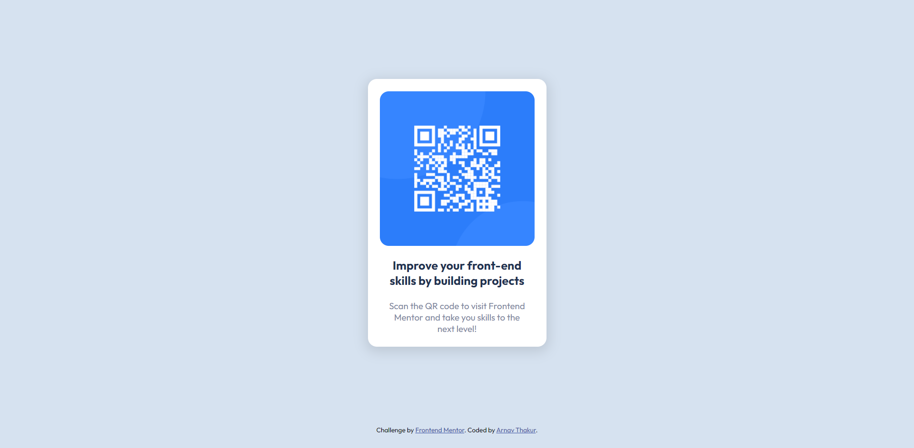

# Frontend Mentor - QR code component solution

This is a solution to the [QR code component challenge on Frontend Mentor](https://www.frontendmentor.io/challenges/qr-code-component-iux_sIO_H). Frontend Mentor challenges help you improve your coding skills by building realistic projects.

## Table of contents

- [Author](#author)

### Screenshot

### Links

- Solution URL: [Add solution URL here](https://your-solution-url.com)
- Live Site URL: [Add live site URL here](https://your-live-site-url.com)

## My process

### Built with

- Semantic HTML5 markup
- CSS custom properties
- Flexbox

## Author

- Website - [Arnav Thakur](https://arnavthakur26.github.io/portfolio/)
- Frontend Mentor - [@Arnavthakur26](https://www.frontendmentor.io/profile/Arnavthakur26)
- Twitter - [@YamiShin0_0](https://twitter.com/YamiShin0_0)
